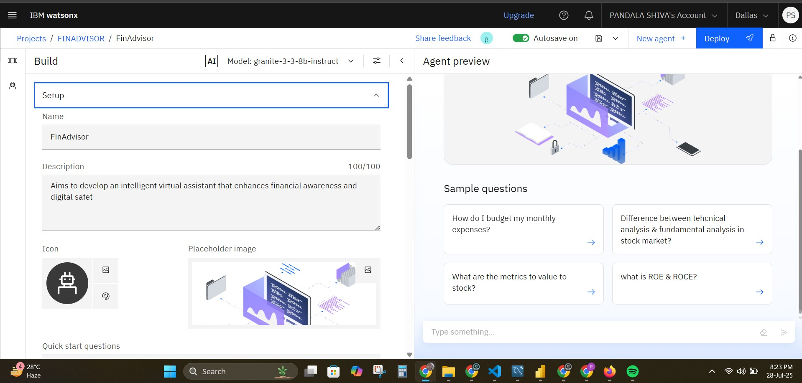
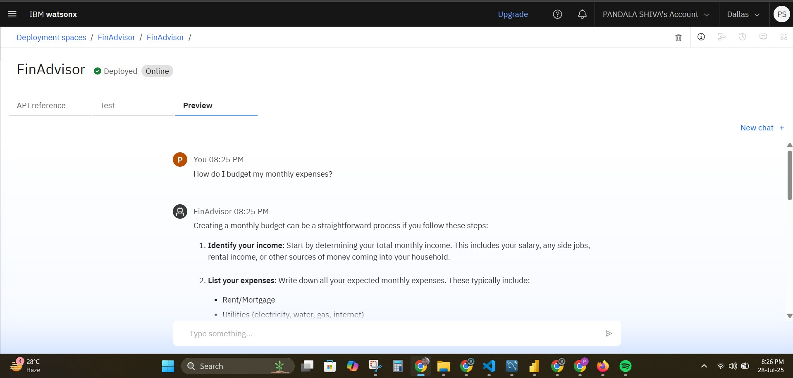

# LearnMate – Agentic AI for Personalized Course Pathways

## 📌 Overview

LearnMate is a digital AI assistant built to help students explore and follow personalized learning journeys. It uses Agentic AI on IBM Cloud and recommends curated course paths based on users' preferences and needs.

## 🛠️ Tech Stack

- **Frontend:** Next.js, TypeScript  
- **Backend:** PostgreSQL, Prisma ORM  
- **Cloud Services:** IBM Cloud, IBM Watson Studio  
- **Storage:** Cloudinary  
- **Tools Used:** Jupyter Notebook, AI Watson Assistant

## 🚀 Features

- AI-driven personalized course recommendations  
- Interest and skill-level detection  
- Cloud-based deployment  
- PDF + Notebook for Financial Literacy  
- Visual tool setup & testing screenshots

## 📁 Files Included

- `FinAdvisor_Standard_Notebook.ipynb` – AI notebook  
- `Financial_Literacy_Content.pdf` – core course content  
- Various `.jpg` images showing agent instructions, setup, testing, etc.

## 🖼️ Screenshots

  
  

## 👩‍💻 Developed By

- Diksha
